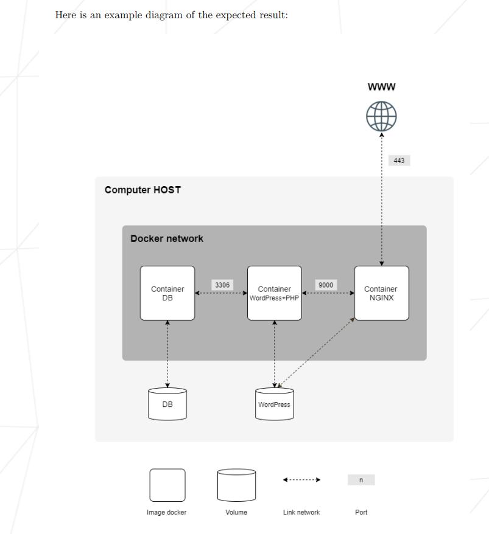

### Foreword :

----

This project aims to expand the knowledge of systems administration using [Docker](https://en.wikipedia.org/wiki/Docker_(software)).
You need to virtualize several [Docker images](https://www.techtarget.com/searchitoperations/definition/Docker-image) by creating them in your personal [virtual machine](https://www.vmware.com/topics/glossary/content/virtual-machine.html).

---

### What is Inception ?

---


---

Inception is an individual project at 1337 which requires us to build an infrastructure of services using [Docker](https://docs.docker.com/get-started/overview/), orchestrated by [Docker Compose](https://docs.docker.com/compose/).

In the mandatory part, a container with [nginx](https://www.nginx.com/resources/glossary/nginx/) and only it must be accessible through port 443, exposing the services of the internal [docker network](https://docs.docker.com/network/) for public access. The [nginx](https://www.nginx.com/resources/glossary/nginx/) service connects to the [wordpress](https://en.wikipedia.org/wiki/WordPress) container running [php-fpm](https://www.php.net/manual/en/install.fpm.php) which stores the data in a [mariadb](https://en.wikipedia.org/wiki/MariaDB) service on the network. The [wordpress](https://en.wikipedia.org/wiki/WordPress) and [mariadb](https://en.wikipedia.org/wiki/MariaDB) website data must be persisted each in its own [volume](https://docs.docker.com/storage/volumes/).

For the bonus we have to configure a container with an [FTP server](https://en.wikipedia.org/wiki/Vsftpd) that accesses the [wordpress](https://en.wikipedia.org/wiki/WordPress) [volume](https://docs.docker.com/storage/volumes/), a static site, [redis](https://redis.io/) to cache the database requests and a useful service of our choice. In this case the service chosen was [ngrok](https://ngrok.com/) to allow local services to be available on the web (public access over the internet).

---

### Project Badge :

---


---

#### Skills :

---

- Rigor.
- Network & system administration.

---

#### Architecture :

</p>
<p align="center">

</p>

---

#### Goal :

---

> Use docker-compose to create a LEMP stack (L for Linux, E for Nginx, M for Mariadb and P for PHP) with wordpress.

---

#### How Docker works ?

---

Docker works by using a client-server architecture, where the Docker client communicates with the Docker daemon to build, run, and manage containers.

When you run a Docker command, such as docker run, the Docker client sends a request to the Docker daemon to run a container. The Docker daemon pulls the image needed to run the container (if it's not already on the host machine), and then creates a container from the image.

The container runs in an isolated environment on the host machine, with its own file system, network, and process space. This isolation ensures that the application running in the container is completely self-contained and does not affect the host machine or other containers running on the same machine.

Docker also provides a centralized mechanism for managing containers, images, and networks. You can use Docker commands to list containers, inspect their state, start and stop containers, and more. Docker also provides a public registry, Docker Hub, where you can find and download images for use in your containers.

In summary, Docker provides a simple and efficient way to package and deploy applications in containers, and manage their lifecycle.

---

#### Setting up the virtual machine :

---

> First download a stable version of debian:buster.
> install without GUI (GUI is for noobs bruh!).

---

#### Configuration :

---

> First use command line as super user / Switch user :

```
$> su
Password:
```

> Update system :

```
$> apt-get update
```

> Then install needed software entring the following command :

```
$> apt-get install sudo ufw docker docker-compose make openbox xinit kitty firefox-esr vim tree \
apt-transport-https ca-certificates curl git systemd 
```

---

### Port forwarding :

---

##### Installing and Configuring UFW :

---

###### Perform the UFW installation :

---

```
$> sudo apt-get install ufw
```

##### Enable UFW :

```
$> sudo ufw enable
```

##### Allow connections to your server through port 4242 :

```
$ ufw allow 4242
```

##### Check the UFW settings :

```
$> ufw status
```

```
$> dpkg -l | grep ufw
```

---

##### Network adapter configuration :

---

##### Add forward rule for VirtualBox :

---

> Go to VirtualBox-> Choose the VM->Select Settings
Choose “Network”-> “Adapter 1"->”Advanced”->”Port Forwarding”
Add new rule (little green button on right top side) and next parameters:

---

**************************************************************************
* Protocol       Host IP       Host Port       Guest IP       Guest Port *
* TCP            127.0.0.1     4242            		      4242       *
**************************************************************************

---

> In your host (physical) machine open Terminal and run [ssh @localhost -p 4242]
Now you can control your virtual machine from the host terminal!

---