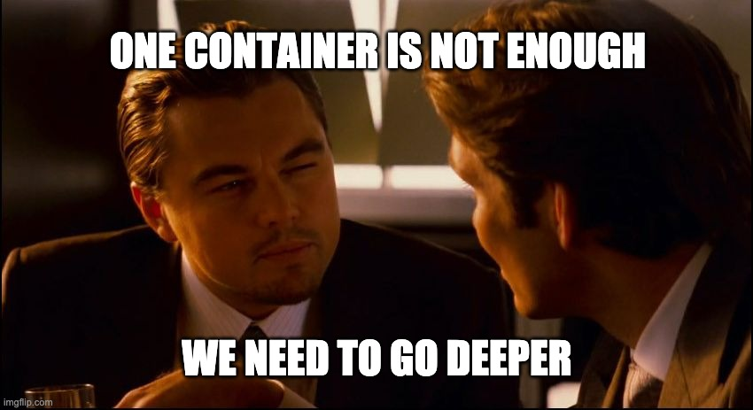

### Foreword :

----

This project aims to expand the knowledge of systems administration using [Docker](https://en.wikipedia.org/wiki/Docker_(software)).
You need to virtualize several [Docker images](https://www.techtarget.com/searchitoperations/definition/Docker-image) by creating them in your personal [virtual machine](https://www.vmware.com/topics/glossary/content/virtual-machine.html).

---

### What is Inception ?

---



---

Inception is an individual project at 1337 which requires us to build an infrastructure of services using [Docker](https://docs.docker.com/get-started/overview/), orchestrated by [Docker Compose](https://docs.docker.com/compose/).

In the mandatory part, a container with [nginx](https://www.nginx.com/resources/glossary/nginx/) and only it must be accessible through port 443, exposing the services of the internal [docker network](https://docs.docker.com/network/) for public access. The [nginx](https://www.nginx.com/resources/glossary/nginx/) service connects to the [wordpress](https://en.wikipedia.org/wiki/WordPress) container running [php-fpm](https://www.php.net/manual/en/install.fpm.php) which stores the data in a [mariadb](https://en.wikipedia.org/wiki/MariaDB) service on the network. The [wordpress](https://en.wikipedia.org/wiki/WordPress) and [mariadb](https://en.wikipedia.org/wiki/MariaDB) website data must be persisted each in its own [volume](https://docs.docker.com/storage/volumes/).

For the bonus we have to configure a container with an [FTP server](https://en.wikipedia.org/wiki/Vsftpd) that accesses the [wordpress](https://en.wikipedia.org/wiki/WordPress) [volume](https://docs.docker.com/storage/volumes/), a static site, [redis](https://redis.io/) to cache the database requests and a useful service of our choice. In this case the service chosen was [ngrok](https://ngrok.com/) to allow local services to be available on the web (public access over the internet).

---

### Project Badge :

---


---

#### Skills :

---

- Rigor.
- Network & system administration.

---

#### Architecture :

* A Docker container that contains NGINX with TLSv1.2 or TLSv1.3 only.
* A Docker container that contains WordPress + php-fpm (it must be installed and configured) only without nginx.
* A Docker container that contains MariaDB only without nginx.
* A volume that contains your WordPress database.
* A second volume that contains your WordPress website files.
* A docker-network that establishes the connection between your containers.

</p>
<p align="center">

</p>

---

#### Goal :

---

> Use docker-compose to create a LEMP stack (L for Linux, E for Nginx, M for Mariadb and P for PHP) with wordpress.

---

#### Setting up the virtual machine :

---

> First download a stable version of debian:buster and install it properly.

---

#### System configuration :

---

> First use command line as super user / Switch user :

```
$> su
Password:
```

> Update system :

```
$> apt-get update
```

> Then install needed software entring the following command :

```
$> apt-get install sudo ufw vim tree apt-transport-https ca-certificates curl git systemd 
```

---

### Port forwarding :

---

##### Installing and Configuring UFW :

---

###### Perform the UFW installation :

---

```
$> sudo apt-get install ufw
```

##### Enable UFW :

```
$> sudo ufw enable
```

##### Allow connections to your server through port 4242 :

```
$ ufw allow 4242
```

##### Check the UFW settings :

```
$> ufw status
```

```
$> dpkg -l | grep ufw
```

---

##### Network adapter configuration :

---

##### Add forward rule for VirtualBox :

---

> Go to VirtualBox-> Choose the VM->Select Settings
Choose “Network”-> “Adapter 1"->”Advanced”->”Port Forwarding”
Add new rule (little green button on right top side) and next parameters:

---

**************************************************************************
* Protocol       Host IP       Host Port       Guest IP       Guest Port *
* SSH                          42            		             42      *
**************************************************************************

---

> In your host (physical) machine open Terminal and run [ssh @localhost -p 4242]
Now you can control your virtual machine from the host terminal!

---

### Docker :

---


---

#### What is docker ?

---

> Docker is an open source project used to build a virtualization environment written in Go language. Compared to the existing virtualization technology, there is little performance loss, so it is used in many infrastructure solutions.

> Docker , which is generally referred to, is used in two contexts depending on the situation. It means Docker Engine , or it is called Docker as a collective name for several Docker projects .

> There are several projects in Docker , such as Docker Compose , Private Registry , Docker Machine , and Kinematic . These Docker projects are meant to use Docker Engine more efficiently, so in the end, the core is Docker Engine .


> Existing virtualization technology used a virtual machine (VM) , a concept in which a hypervisor exists on a host OS and guest OSes exist on top of it. Virtualization here means creating a space independent of the space of the machine you are currently using.
Docker also uses virtualization technology, but it is not structured using Hypervisor and Guest OS as before.
Hypervisor manages Guest OS and virtualizes resources so that system resources can be distributed to Guest OS . Among the processes, a lot of performance degradation occurs when virtualization of devices such as I/O used in the host OS is performed. And even when using a VM like this , you can create an image as in the case of using Docker . Since the image is created with the Kernel of the Guest OS included, not only the size of the image is quite large, but the image creation time is longer as the Kernel is included. long.
For these reasons, various attempts were made on paravirtualization technologies such as Intel 's Xen and Linux 's KVM , and after that, a technology called Container became the standard of virtualization technology.
Container is a technology that is used on Linux and is implemented only with Linux's own functions such as chroot , namespace , and cgroup to create an independent space for each process. Docker 's container uses Linux 's container , and by adding several functions to Linux 's container , it makes it easier to use the application as a container .

---

#### How Docker works ?

---

Docker works by using a client-server architecture, where the Docker client communicates with the Docker daemon to build, run, and manage containers.

When you run a Docker command, such as docker run, the Docker client sends a request to the Docker daemon to run a container. The Docker daemon pulls the image needed to run the container (if it's not already on the host machine), and then creates a container from the image.

The container runs in an isolated environment on the host machine, with its own file system, network, and process space. This isolation ensures that the application running in the container is completely self-contained and does not affect the host machine or other containers running on the same machine.

Docker also provides a centralized mechanism for managing containers, images, and networks. You can use Docker commands to list containers, inspect their state, start and stop containers, and more. Docker also provides a public registry, Docker Hub, where you can find and download images for use in your containers.

In summary, Docker provides a simple and efficient way to package and deploy applications in containers, and manage their lifecycle.

---